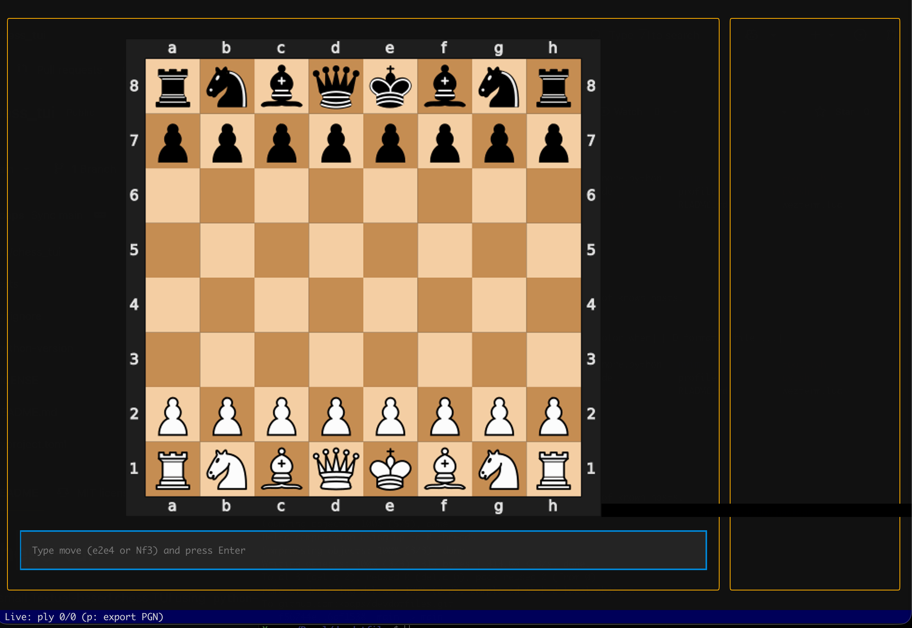

# chess-tui

A small Textual-based chess TUI using `python-chess`.

## Create venv
```bash
uv venv --seed
````

## Run
```bash
poetry install
poetry run chess-tui
```

## Keys
- Enter a move in SAN (`Nf3`, O`-O`) or UCI (`e2e4`)
- `Up/Down`: step through game by ply (half-move)
- `Shift+Up/Shift+Down`: step by full-move rows (with snap-to-row-start behavior when mid-row)
- `Home/End`: jump to start/end
- `p`: export PGN to `./game.pgn`
- `q` or `Esc`: quit




## Known Issues
* There's a black bar artifact that seems to be coming from the image rendering or widget, but I haven't been able to nail it down. I verified it's not part of CSS or the other widgets by using a Placeholder widget and verified it's not the actual image by writing that to a file, so it's something with how the image is being rendered with textual-image module.
